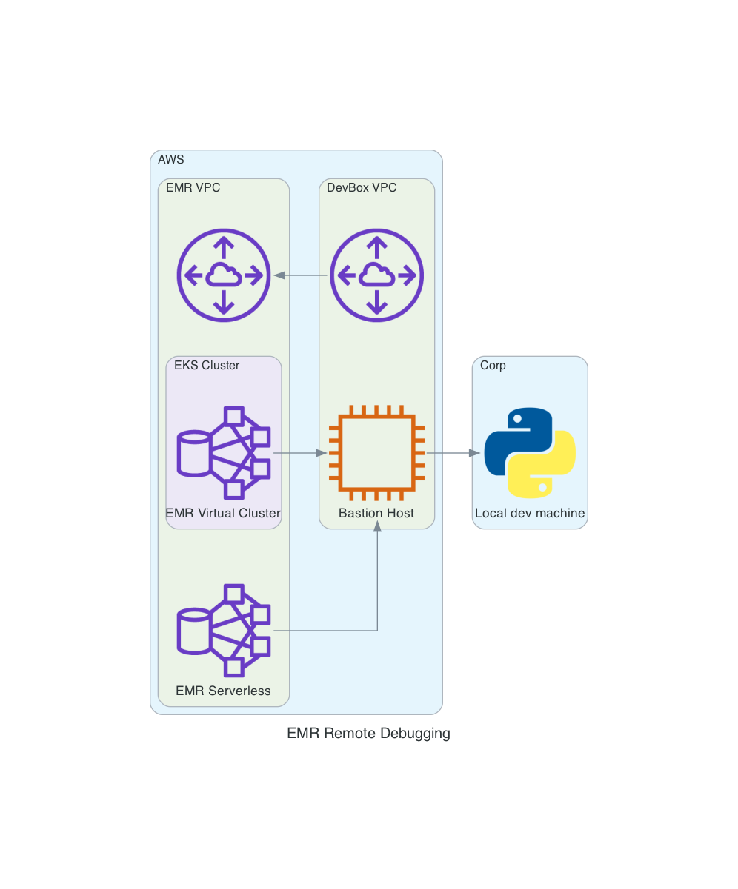

# EMR Remote Debugging

A sample walkthrough with accompanying CDK stack that shows how to use a bastion host with PyCharm to debug Spark jobs on EMR.

## Overview

This repository includes examples for EMR on EKS and EMR Serverless.

It includes a CDK stack that deploys each environment as well as a centralized bastion machine that is configured to receive remote debugging requests from any of these services.

The bastion machine resides in its own VPC, while all the EMR resources are in a second VPC.



## Pre-requisites

- AWS account and credentials
- NodeJS v18 and Python 3.11
- Docker (or similar)
- [AWS CLI](https://aws.amazon.com/cli/) + [Session Manager plugin](https://docs.aws.amazon.com/systems-manager/latest/userguide/session-manager-working-with-install-plugin.html)

For ease of getting started, a devcontainer is provided with all the necessary dependencies.

## Getting started

Deploy the CDK stack.

> [!WARNING]
> This stack deploys resources you will be billed for, including an EKS cluster and EC2 instances.

```bash
cdk deploy --all --require-approval never --context eks_admin_role_name=Admin
```

`eks_admin_role_name` is an IAM role that will be granted access to manage your EKS environment.

Once the stack fully deploys, you'll see a variety of outputs that will be useful in future steps.

## Update Bastion with SSH key

This could be enabled with CDK, but it's easier to do manually with my setup.

The stack is deployed with SSM so you can remotely manage, but we want to easily login as the `ec2-user` and port forward.

So using SSM, we'll connect to the instance ID from the `DevBox.DevBoxID` output and add our key.

```bash
INSTANCE_ID=<REPLACE WITH CDK DevBox.DevBoxID VALUE>
cat ~/.ssh/id_ecdsa.pub | pbcopy
aws ssm start-session --region us-west-2 --target ${INSTANCE_ID}
```

`su` to the `ec2-user` then update `.ssh/authorized_keys` (I just use `vi`)

```bash
sudo su - ec2-user
```

Now we can remote-forward to our local machine with SSH (as we've already setup [AWS-StartSSHSession](https://docs.aws.amazon.com/systems-manager/latest/userguide/session-manager-getting-started-enable-ssh-connections.html#ssh-connections-enable))

```shell
ssh -R '3535:localhost:3535' ec2-user@${INSTANCE_ID}
```

## Remote Debugging

Next, open up the [demo_code](./demo_code/) folder in PyCharm. We'll continue with the README in there.

## Conclusion

When you're done, make sure you destroy your stack.

```bash
cdk destroy --all
```